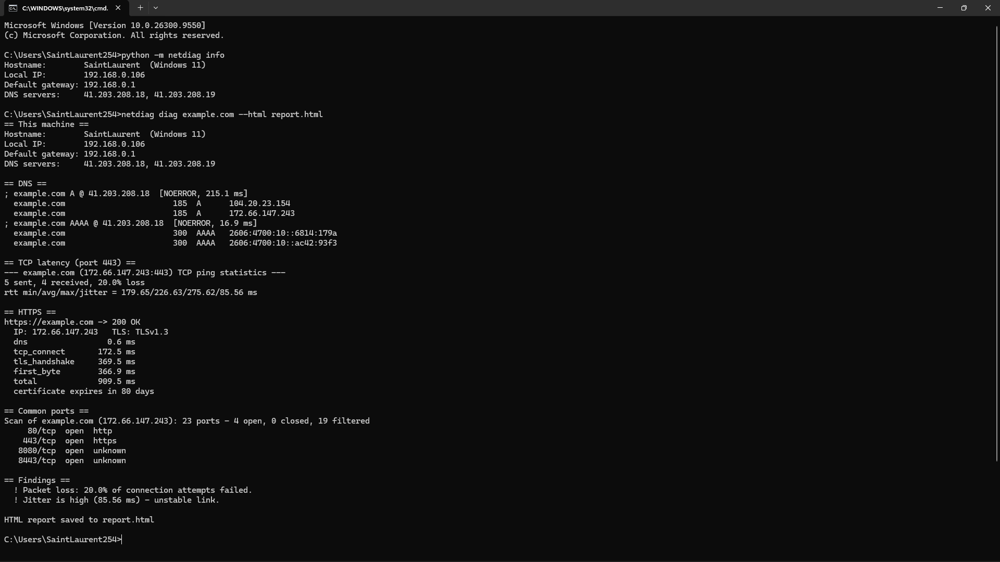
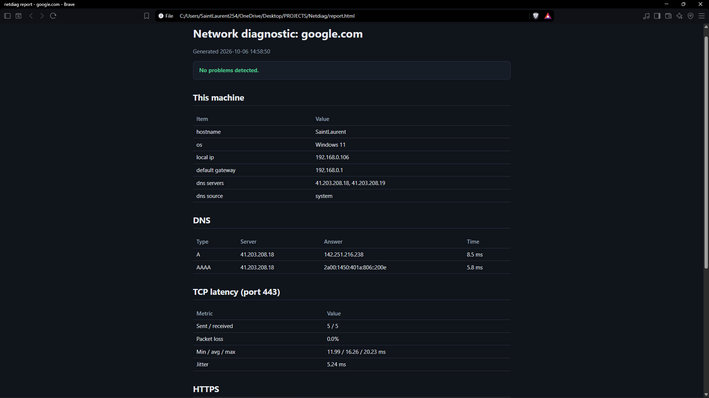

# netdiag: Network Diagnostic Toolkit

A Python command-line toolkit that finds out *what is wrong* with a network connection and explains the networking concept behind each result.

Standard library only, so there is nothing to install but Python 3.8+.

`netdiag diag <host>` runs every check in one go and finishes with a plain-language list of problems.

## Screenshots

### Diagnostic Terminal Output


### HTML Diagnostic Report



## Features

* **One-command diagnosis** of DNS, latency, HTTPS and open ports, with an HTML or JSON report
* **Hand-built DNS client** with UDP and TCP fallback, name compression, custom resolvers and resolver comparison
* **TCP latency, packet loss and jitter** with no administrator rights, plus a live `monitor` mode
* **HTTPS timing breakdown** covering DNS, TCP connect, TLS handshake and first byte, plus certificate expiry
* **Threaded port scanner** that distinguishes open, closed and filtered ports
* **Local network information** including IP address, default gateway and DNS servers on Windows, macOS and Linux

## Installation

```bash
git clone https://github.com/<your-username>/netdiag.git
cd netdiag
pip install -e .
```

No installation is needed to try it directly from the project folder:

```bash
python -m netdiag diag example.com
```

On Windows, if `netdiag` is not recognized after installation, pip's Scripts folder may not be on your PATH. Pip will display the folder location in its warning.

You can either add that folder to your PATH and reopen your terminal, or continue using:

```bash
python -m netdiag
```

## Usage

### Run a Full Diagnostic

```bash
netdiag diag example.com --html report.html
```

Runs the complete diagnostic and generates a shareable HTML report.

### Local Network Information

```bash
netdiag info
```

Displays the machine's IP address, default gateway and DNS servers.

### Test Latency, Packet Loss and Jitter

```bash
netdiag ping example.com -c 5
```

### Monitor a Connection

```bash
netdiag monitor 1.1.1.1
```

Continuously monitors latency and packet loss until `Ctrl+C` is pressed.

### DNS Queries

```bash
netdiag dns example.com -t A MX TXT
```

### Compare DNS Resolvers

```bash
netdiag dns example.com -s 8.8.8.8 -s 1.1.1.1
```

### Reverse DNS Lookup

```bash
netdiag rdns 8.8.8.8
```

### Port Scanning

```bash
netdiag scan 192.168.1.1 -p 1-1024 --banner
```

### HTTPS Diagnostics

```bash
netdiag http https://example.com
```

Displays timing information for DNS resolution, TCP connection, TLS handshake and server response, along with certificate expiry information.

### Route Tracing

```bash
netdiag trace example.com
```

Uses the system's traceroute/tracert utility to show the network path to a destination.

`ping`, `dns`, `rdns`, `scan`, `http` and `info` accept `--json`.

### Exit Codes

| Code | Meaning                        |
| ---- | ------------------------------ |
| `0`  | No problem detected            |
| `1`  | A network problem was detected |
| `2`  | Invalid input                  |

## Which Command When

| Situation                         | Run                                                                       |
| --------------------------------- | ------------------------------------------------------------------------- |
| Something is wrong, cause unknown | `netdiag diag <site>`                                                     |
| Is it the site or just me?        | `netdiag http <site>` and `netdiag ping <site>`                           |
| Pages load slowly                 | `netdiag dns <site> -s <isp-dns> -s 8.8.8.8`, then `netdiag trace <site>` |
| Connection drops on and off       | `netdiag monitor 1.1.1.1`                                                 |
| Checking what a device exposes    | `netdiag scan <your-own-device>`                                          |

## What Each Tool Teaches

| Tool               | Concept                                                                  |
| ------------------ | ------------------------------------------------------------------------ |
| `ping` / `monitor` | TCP handshake time as RTT, packet loss and jitter                        |
| `dns` / `rdns`     | DNS wire format, record types, resolver differences, NXDOMAIN vs timeout |
| `scan`             | Open, closed (RST) and filtered (silence) port states                    |
| `http`             | Where time goes: DNS, TCP, TLS and server response                       |
| `trace`            | TTL expiry and hop-by-hop network path                                   |
| `diag`             | Reading network symptoms to identify the failing layer                   |

## Project Layout

```text
netdiag/
  cli.py          argument parsing, output formatting, the diag workflow
  tcp_ping.py     TCP handshake timing, loss, jitter
  dns_tools.py    hand-built DNS client
  portscan.py     threaded connect scanner, banner grabbing
  http_check.py   per-phase HTTP(S) timing, TLS version, certificate expiry
  info.py         local IP, gateway, DNS servers
  system_tools.py wrappers for system ping / traceroute
  report.py       self-contained HTML report
tests/            17 tests using local servers and a fake DNS server
```

Each module returns plain dictionaries and never prints, allowing the functionality to be reused by a GUI, web interface or other applications.

## Tests

Run the test suite with:

```bash
python -m unittest discover -s tests -v
```

The tests use local servers and a fake DNS server, so they do not require an internet connection.

## Notes and Limitations

* **Only scan systems you own or have permission to test.**
* `trace` and `ping --icmp` use the system tools; the toolkit does not send raw ICMP itself.
* Port scans are TCP connect scans. "Filtered" means no reply, usually because of a firewall.
* On Windows, the scanner waits at least 2.5 seconds per port because Windows can be slow to report closed ports.
* Latency is measured using TCP handshakes, so it reflects what applications experience rather than ICMP echo time.

## Roadmap

Planned improvements include:

* UDP scanning
* DNSSEC checks
* Web interface
* Enhanced terminal interface
* Additional diagnostic and reporting features

## License

<<<<<<< HEAD
MIT License. See [LICENSE](LICENSE).
=======
This project is licensed under the MIT License. See the [LICENSE](LICENSE) file for details.
>>>>>>> d4c7e9c (Add MIT license)
